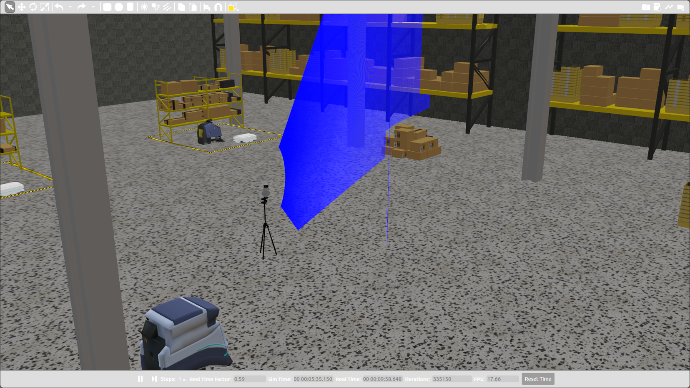

<h1 align="center"> Robot-base large scale mapping </h1>


<h2 align="center"> How to install and build </h2>



Requirements
Ubuntu 24.04.1 LTS
https://ubuntu.com/download/desktop


If you are using proxy, add the following lines, modifying them to match your environment:
```
export http_proxy=username:password@proxyhost.com:8080
export https_proxy=username:password@proxyhost.com:8081
exprot no_proxy=localhost, 127.0.0.1, *.my.lan
```

Install ROS2 Jazzy
-----------------------------------------------------------------------------------------------------------------------


Enable Ubuntu Universe repository.

```
sudo apt install software-properties-common
sudo add-apt-repository universe
```
-----------------------------------------------------------------------------------------------------------------------


Add the ROS2 GPG key with apt.

With no proxy:
```
sudo apt update && sudo apt install curl -y
sudo curl -sSL https://raw.githubusercontent.com/ros/rosdistro/master/ros.key -o /usr/share/keyrings/ros-archive-keyring.gpg
```

with proxy:
```
sudo apt update && sudo apt install curl -y
sudo curl -sSL -x export http_proxy=username:password@proxyhost.com:8080 https://raw.githubusercontent.com/ros/rosdistro/master/ros.key -o /usr/share/keyrings/ros-archive-keyring.gpg
```
-----------------------------------------------------------------------------------------------------------------------


Add the repository to your sources list.

```
echo "deb [arch=$(dpkg --print-architecture) signed-by=/usr/share/keyrings/ros-archive-keyring.gpg] http://packages.ros.org/ros2/ubuntu $(. /etc/os-release && echo $UBUNTU_CODENAME) main" | sudo tee /etc/apt/sources.list.d/ros2.list > /dev/null
```
-----------------------------------------------------------------------------------------------------------------------


Install ROS2 and extra packages.
```
sudo apt update
sudo apt upgrade
```
```
sudo apt install ros-jazzy-desktop
sudo apt install ros-jazzy-pcl-conversions
sudo apt install ros-dev-tools
```

-----------------------------------------------------------------------------------------------------------------------
Install Gazebo Harmonic

```
sudo apt-get update
sudo apt-get install ros-jazzy-ros-gz
```
-----------------------------------------------------------------------------------------------------------------------


Install OpenCV
```
sudo apt install libopencv-dev
```
-----------------------------------------------------------------------------------------------------------------------


Clone and build project

```
cd
git clone https://<github_user>:<git_hub_token>@github.com/intel-sandbox/applications.robotics.mapping.robot-based-large-scale-mapping-ros2.git
cd applications.robotics.mapping.robot-based-large-scale-mapping-ros2
```

```
source /opt/ros/jazzy/setup.bash
colcon build --packages-select interfaces
source install/setup.bash
colcon build
```
-----------------------------------------------------------------------------------------------------------------------


<h2 align="center"> How to use </h2>

Go to the project folder:

```
cd applications.robotics.mapping.robot-based-large-scale-mapping-ros2

```

Source ROS2 Jazzy and project:

```
source /opt/ros/jazzy/setup.bash
source install/setup.bash

```

To configure the parameters open the file src/ptu_custom_description/config/params.yaml


PREPARE MODEL TO SCAN

To run a full scan of a model .obj 
  * Place you model in the folder "src/mapping_custom_description/models/obj" 
  * Change the name of the model to "model.obj" 
  * Run the command

```
ros2 launch mapping_bringup scan_obj.launch.py

```

To run a full scan of a model .dae 
  * Place you model in the folder "src/mapping_custom_description/models/dae" 
  * Change the name of the model to "model.dae" 
  * Run the command

```
ros2 launch mapping_bringup scan_dae.launch.py

```


To run a full scan of a model .stl 
  * Place you model in the folder "src/mapping_custom_description/models/stl" 
  * Change the name of the model to "model.stl" 
  * Run the command 

```
ros2 launch mapping_bringup scan_stl.launch.py

```


START SCAN
```
ros2 launch mapping_bringup start_scan.launch.py

```